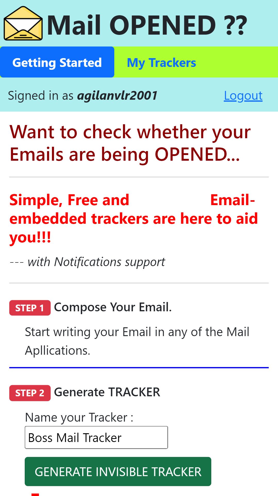
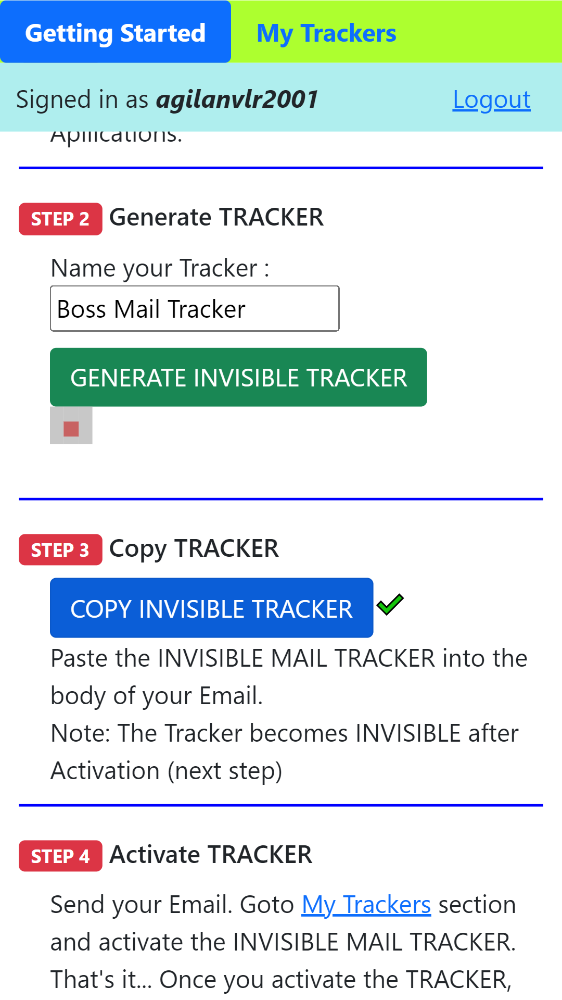
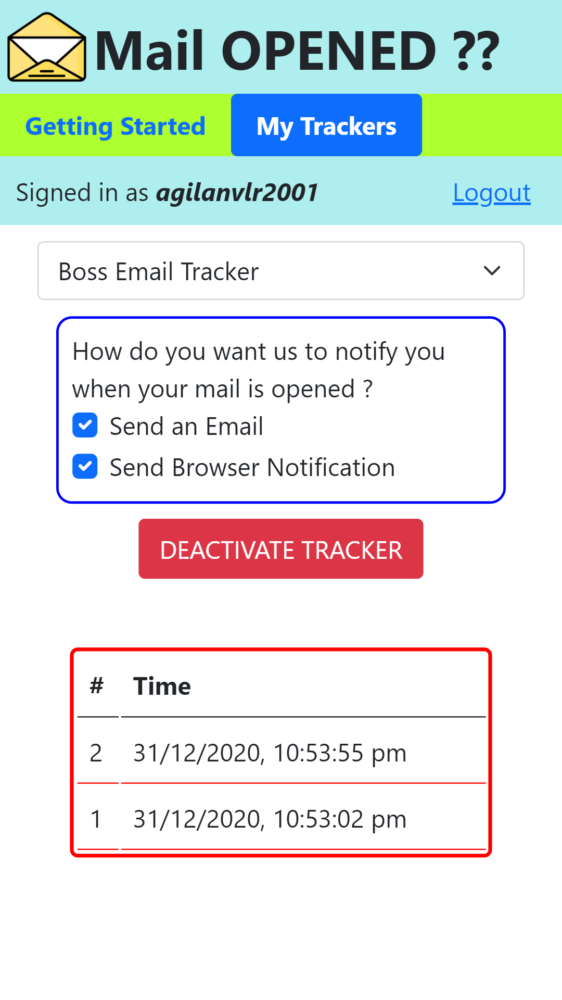

# Mail-Opened
## Web App to implant Invisible Email Embedded Trackers to notify when an Email is opened
>## LIVE link : https://mail-opened.web.app/
>## 50 sec USAGE DEMO VIDEO : https://mail-opened.web.app/res/demo-video.mp4

### Technologies:
* Firebase Authentication
* Firebase Cloud Messaging
* Firebase RealTime Database
* Firebase Hosting
* AWS Lambda functions
* Bootstrap CSS

### KEY Concept:
* AWS Lambda function that logs the query parameter (uid and key) and returns a 1x1 empty PNG image is set up.
* When a new Tracker is created, PNG image is shown with uid and key appended as queries to the image URL
* The PNG image is copied to the mail, and when the mail is opened, during the image request, the uid and key are logged by the AWS Lambda function.